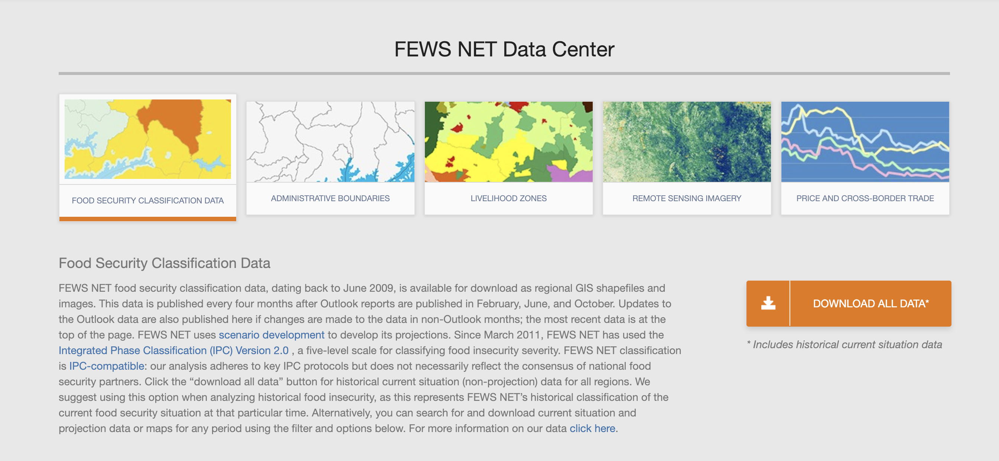
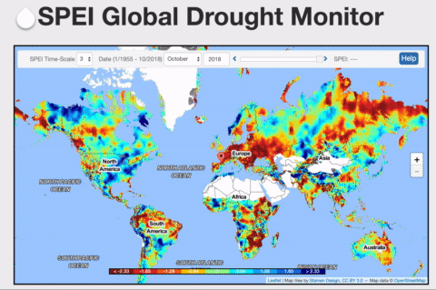
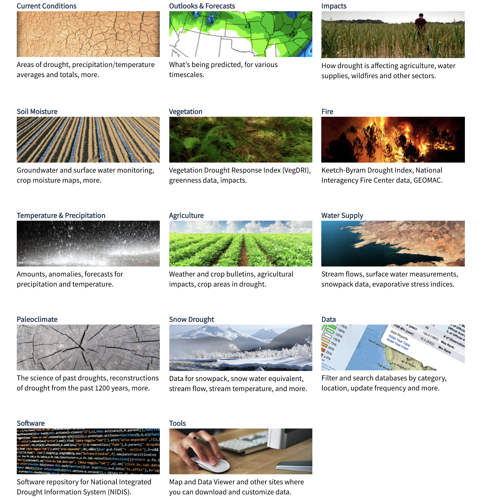

import {Head} from 'mdx-deck'
import {SplitRight} from 'mdx-deck/layouts'

export {default as theme} from './theme'

<Head>
  <title>Useful Datasets</title>
</Head>

# Useful datasets

Presenter: Gabriel Wu < <wuzihua@pku.edu.cn> >

---

## Contents

### I. Datasets

### II. How can we use these data?

```notes
- Create speaker notes in fenced code blocks
```

---

## I. Datasets

### I.1 [FEWS NET Data Center](http://fews.net/fews-data/333)

### I.2 [Global SPEI database](http://spei.csic.es/database.html)

### I.3 [NIDIS Data, Maps & Tools](https://www.drought.gov/drought/data-maps-tools)

---

export default SplitRight



### I.1 FEWS NET Data Center

- <http://fews.net/fews-data/333>
- Food Security Classfication
- Administrative Boundaries
- Livelihood Zones
- Remote Sensing Imagery
- Price and Cross-Border Trade

---

### I.1.A Remote Sensing Imagery

- USGS FEWS NET Data Portal
- NOAA Climate Prediction Center Data Portal
- Climate Hazard Group (CHG) Portal
- Climate Engine

---

export default SplitRight



### I.2 Global SPEI database

- <http://spei.csic.es/database.html>
- Time scale: 1-month to 48-month
- Time range: 1901--2015 (Downloadable) / 1955--2018 (Online)
- Spatial resolution: 0.5 degree
- Format: NetCDF

---

export default SplitRight



### I.3 NIDIS Data, Maps & Tools

- <https://www.drought.gov/drought/data-maps-tools>
- Categories: Current conditions / Outlooks & Forecasts / Impacts / Soil
  moisture / Vegetation / Fire / Temperature & Precipitation / Agriculture /
  Water Supply / Paleoclimate / Snow Drought
- Insight (taking 'Current conditions' as an example): USDM / PDSI / Drought
  Change / Drought Outlook

---

## II. How can we use these data?

### II.1 Drought

### II.2 Others

---

### II.1 Drought

- To validate new indices or approaches

---

### II.2 Others
