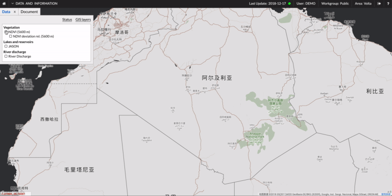

import {Head} from 'mdx-deck'
import {SplitRight} from 'mdx-deck/layouts'

export {default as theme} from './theme'

<Head>
  <title>Useful Datasets</title>
</Head>

# Useful datasets

Presenter: Gabriel Wu < <wuzihua@pku.edu.cn> >

---

## Contents

### I. Drought Monitoring Systems

### II. Databases behind them

### III. How can we use these data?

```notes
- Create speaker notes in fenced code blocks
```

---

## I. Drought Monitoring Systems

### I.1 [FEWS NET Data Center](http://fews.net/fews-data/333)

### I.2 [Global SPEI database](http://spei.csic.es/database.html)

### I.3 [NIDIS Data, Maps & Tools](https://www.drought.gov/drought/data-maps-tools)

### I.4 [GIDMaPS](http://drought.eng.uci.edu/)

### I.5 [Flood and Drought Portal](http://www.flooddroughtmonitor.com/home)

### I.6 [EDO](http://edo.jrc.ec.europa.eu/edov2/php/index.php?id=1000)

### 1.7 [PCA](http://princetonclimate.com/)

---

export default SplitRight


### I.1 FEWS NET Data Center

- <http://fews.net/fews-data/333>
- Food Security Classfication
- Administrative Boundaries
- Livelihood Zones
- Remote Sensing Imagery
- Price and Cross-Border Trade

---

export default SplitRight


### I.1.A Remote Sensing Imagery

- <http://fews.net/fews-data/336>
- USGS FEWS NET Data Portal
- NOAA Climate Prediction Center Data Portal
- Climate Hazard Group (CHG) Portal
- Climate Engine

---

export default SplitRight


### I.1.B FEWS Data Downloads

- Global: PET / ET / CHIRPS 2.0
- Regional: RFE / PET / ET / CHIRPS / MODIS NDVI

---

export default SplitRight


### I.2 Global SPEI (Standardized Precipitation-Evapotranspiration Index) database

- <http://spei.csic.es/database.html>
- Time scale: 1-month to 48-month
- Time range: 1901--2015 (Downloadable) / 1955--2018 (Online)
- Spatial resolution: 0.5°
- Format: NetCDF

---

export default SplitRight


### I.3 NIDIS Data, Maps & Tools

- <https://www.drought.gov/drought/data-maps-tools>
- Categories: Current conditions / Outlooks & Forecasts / Impacts / Soil
  moisture / Vegetation / Fire / Temperature & Precipitation / Agriculture /
  Water Supply / Paleoclimate / Snow Drought

---

export default SplitRight


### I.3.A Current conditions

- USDM
- PDSI
- Drought Change
- Drought Outlook

---

export default SplitRight


### I.4 GIDMaPS (Global Integrated Drought Monitoring and Prediction System)

- <http://drought.eng.uci.edu/>
- SPI - Standardized Precipitation Index
- SSI - Standardized Soil Moisture Index
- MSDI - Multivariate Standardized Drought Index
- To get full datasets, we can contact [Prof. Amir Aghakouchak](mailto:amir.a@uci.edu)

---

### I.5 Flood and Drought Portal

- <http://www.flooddroughtmonitor.com/data>



---

### I.6 EDO (European Drought Observatory)

- <http://edo.jrc.ec.europa.eu/edov2/php/index.php?id=1111>


---

### I.6.A Downloading data


---

export default SplitRight


### I.7 PCA (Princeton Climate Analytics)

- <https://platform.princetonclimate.com/PCA_Platform/>
- AFDM / LAFDM / USFDM / APGD
- MSWEP Retrospective / NRT
- ...

---

### I.7.A LAFDM

- <https://platform.princetonclimate.com/LAFDM/interface.php?locale=cn>


---

## II. Databases behind them

### II.1 [CHIRPS](http://chg.geog.ucsb.edu/data/chirps/)

### II.2 [MERRA](https://gmao.gsfc.nasa.gov/merra/)

---

export default SplitRight


### II.1 CHIRPS (Climate Hazards Group InfraRed Precipitation with Station data )

- <http://chg.geog.ucsb.edu/data/chirps/>
- Time range: 1981 -- now
- Spatial coverage: 50°S -- 50°N
- Spatial resolution: 0.05°
- Download: <ftp://ftp.chg.ucsb.edu/pub/org/chg/products/CHIRPS-2.0>

---

export default SplitRight


### II.2 MERRA (Modern-Era Retrospective analysis for Research and Applications) / MERRA-2

- <https://gmao.gsfc.nasa.gov/merra/>
- Temporal resolution: 1 hour to 1 month
- Spatial resolution: 0.5° x 0.667°, 1° x 1.25°, 1.25° x 1.25°

---

## III. How can we use these data?

### III.1 Drought

### III.2 Others

---

### III.1 Drought

- To validate new indices or approaches
- To analyze global or regional trends
- To evaluate drought's impact on vegetation, especially crops

---

### III.2 Others

- Agricultural remote sensing from a more comprehensive perspective
- Global and regional evapotranspiration
- Global water cycle
- Global change
- ...

---

# Thank you!